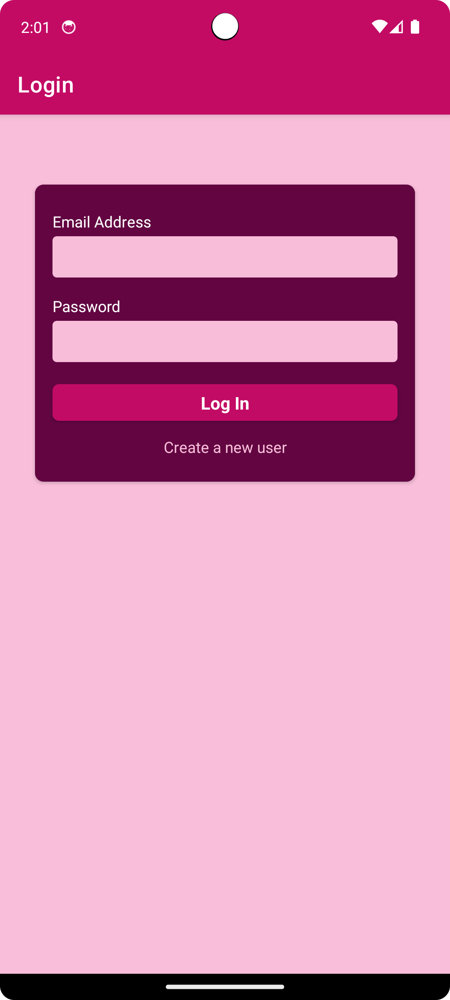
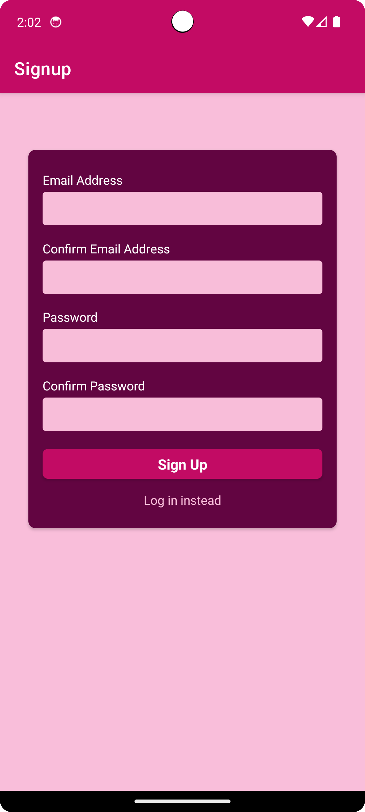
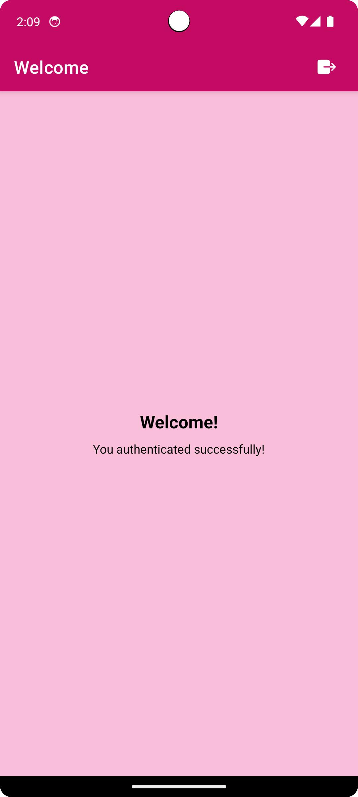
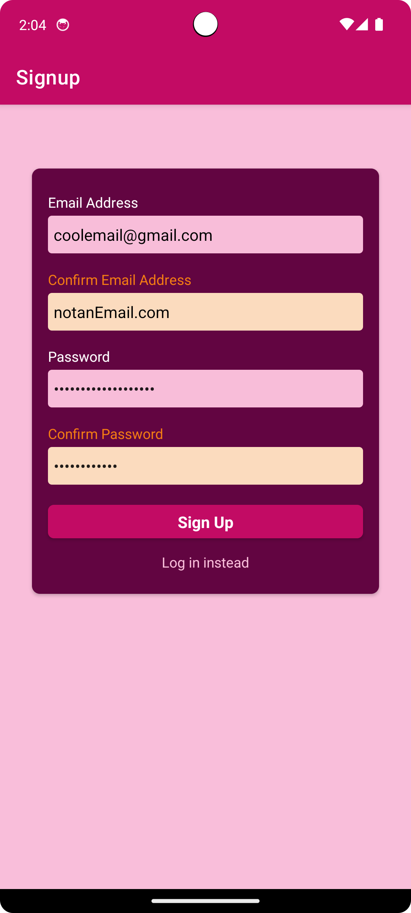

# UserAuthentication 🔐

[](LICENSE)
[](https://reactnative.dev/)
[](https://firebase.google.com/)

Aplicativo demonstrativo de autenticação com Firebase, implementando:
- Cadastro/login com e-mail/senha
- Validação de formulários em tempo real
- Gerenciamento de sessão com Context API
- Navegação protegida com Native Stack

<p align="center">
  
    
</p>
<p align="center">
  
  
</p>


## 🛠 Tecnologias Utilizadas

- **Frontend**:
  - React Native
  - Native Stack Navigation
  - Context API + useReducer
  - React Async Storage

- **Backend**:
  - Firebase Authentication
  - Axios para requisições HTTP

## 🔐 Funcionalidades Principais

✅ **Fluxo de Autenticação Completo**
- Cadastro de novo usuário
- Login com e-mail/senha
- Logout seguro

✅ **Validação em Tempo Real**
- Verificação de formato de e-mail
- Força da senha
- Mensagens de erro claras

✅ **Proteção de Rotas**
- Redirecionamento automático para login
- Acesso restrito a áreas autenticadas
- Persistência de sessão

✅ **Gerenciamento de Estado**
- Context API para dados do usuário
- Loading states durante requisições
- Tratamento de erros

## 🔐 Variáveis de Ambiente

Crie um arquivo `.env` na raiz do projeto:

```env
API_KEY=sua_api_key_do_firebase_aqui
```

## 🚀 Como Executar

1. Clone o repositório:

```bash
git clone https://github.com/pedester321/RNuserAuthentication
cd userAuthentication
```

2. Instale as dependências:

```bash
npm install
```

3. Inicie o aplicativo:

```bash
npm start
```

Ou, se estiver usando Expo:

```bash
expo start
```

4. Escaneie o QR Code com o aplicativo Expo Go no celular ou use um emulador.

## 📝 Licença

Este projeto está licenciado sob a licença MIT.

---

Desenvolvido por Pedro Castro como parte do curso **React Native - The Practical Guide** na Udemy.